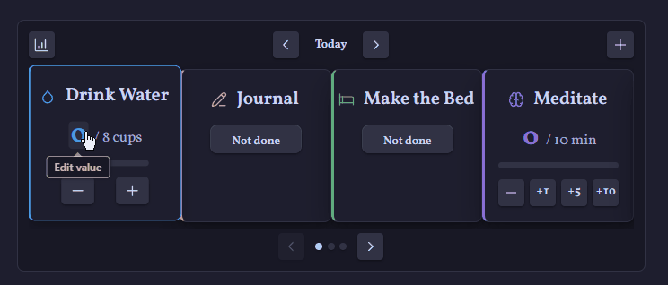
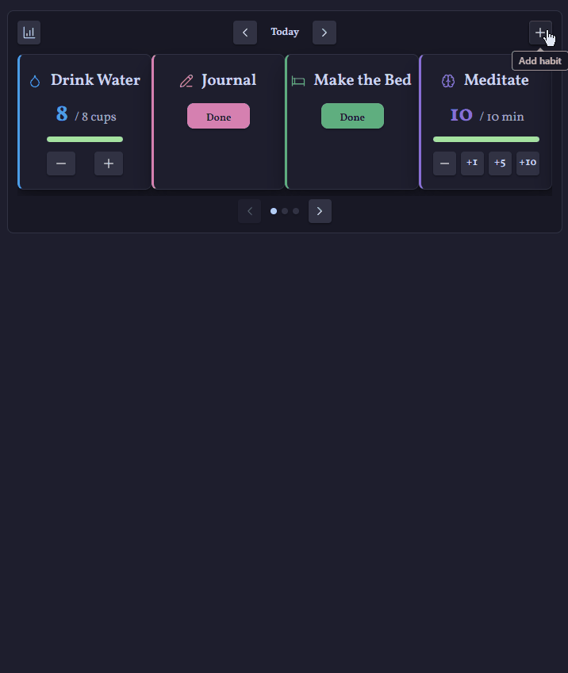
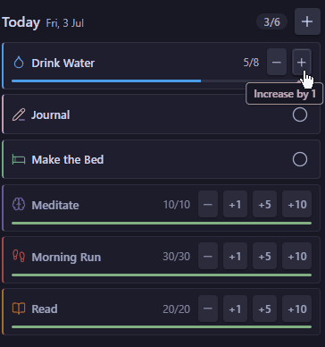
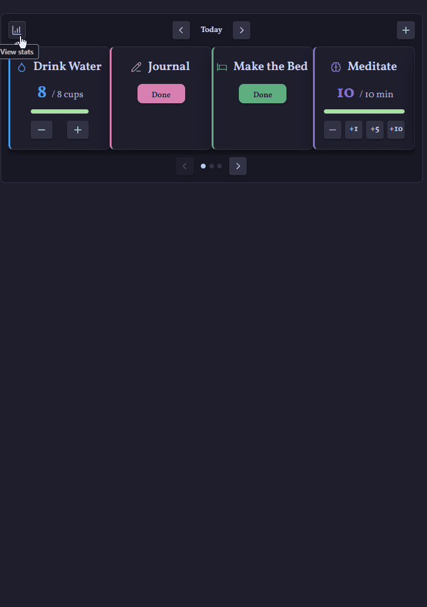
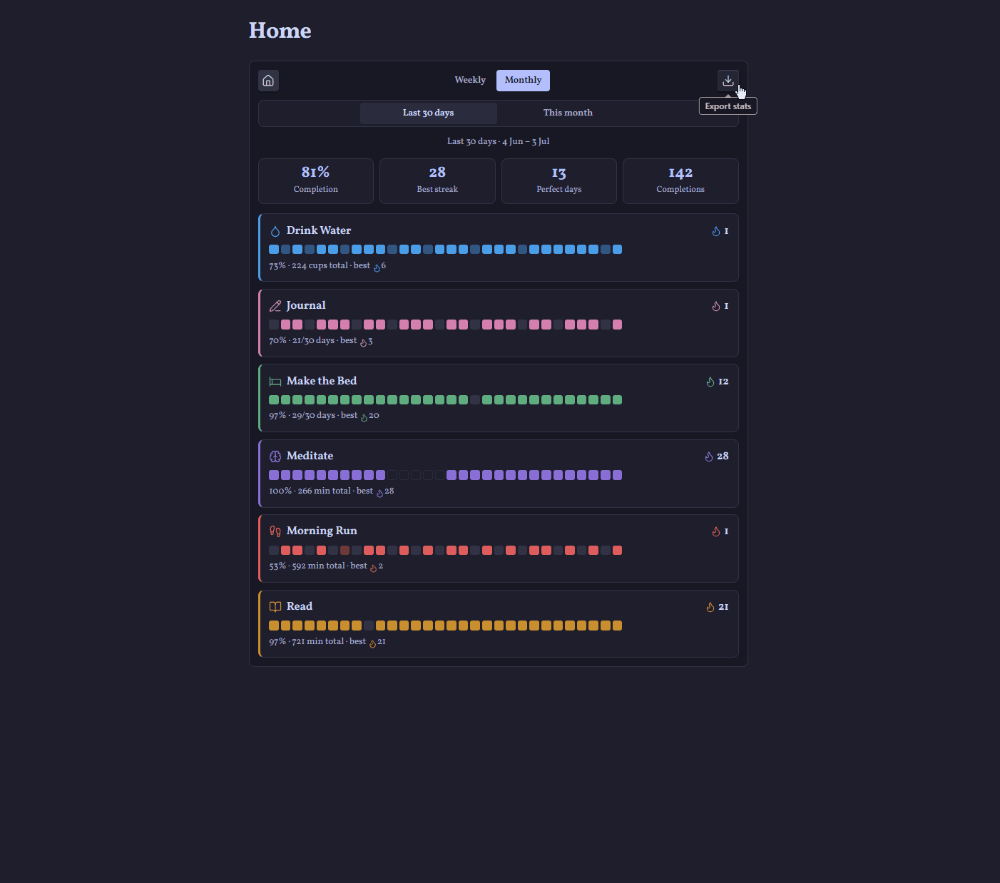

# Habits — habit tracker for Obsidian

**Build streaks. Log daily habits. Watch your progress with charts, heatmaps, and printable reports — all stored as plain Markdown notes in your vault.**




## ✨ Features at a glance

- 🎠 **Carousel dashboard** — log your habits from any note with a `habits` code block, with satisfying completion animations
- ✅ **Three habit types** — done/not-done, counted (8 cups of water), and timed (30 minutes of exercise, with +1/+5/+10 quick buttons)
- 🔥 **Streaks and statistics** — current and best streaks, completion rates, perfect days, weekly and monthly goals, per-habit heatmaps
- 📊 **Charts on every habit page** — 30-day activity and 12-week trend charts rendered in your theme's colours
- 📄 **Printable PDF reports** — pick your metrics, date range, and layout with a live A4 preview
- 📌 **Sidebar quick-log panel** — check off today's habits from anywhere, sized for narrow panes
- ⏸️ **Pause without penalty** — ill or travelling? Paused days never break streaks or drag down your stats
- 📅 **Daily-note aware** — a dashboard inside `2026-07-01.md` shows that day's habits automatically
- 📱 **Mobile friendly** — responsive cards, long-press menus, and a configurable mobile layout
- 🎨 **Theme native** — every colour comes from your theme; custom accents and icons per habit

## 🚀 Quick start

1. Enable the plugin, then run the command **Habits: Create habit** and define your first habit.
2. Run **Habits: Insert dashboard** in any note (your homepage, or your daily-note template) to place the tracker:

   ````markdown
   ```habits
   ```
   ````

3. Log your progress from the dashboard, or open the sidebar panel (ribbon icon or **Habits: Open panel**) to tick things off as you go.



## 📓 Your data stays yours

Each habit is a single Markdown note in a folder of your choice (default: `Habits`). The frontmatter defines the habit and stores one value per day — readable, portable, and future-proof:

```yaml
---
habit: true
type: repetition
target: 8
unit: cups
icon: droplet
color: "#7c6cff"
startDate: 2026-07-01
weeklyTarget: 5
records:
  2026-07-01: 5
pauses:
  - start: 2026-06-10
    end: 2026-06-14
---
```

No databases, no external services — delete the plugin and your history is still right there in your notes.

## 🎠 The dashboard

Cards for each habit sit in a swipeable carousel. Completing a habit plays a celebration animation and the card glides to the back of the queue, keeping what's left front and centre. Click a card's name to open its note; right-click (or long-press on mobile) for editing, pausing, stopping, or removing.

Embedded in a **daily note**? The dashboard follows that note's date, so browsing yesterday's note shows yesterday's habits. The dashboard also live-updates whenever your habit notes or settings change — even from another pane or device sync.

## 📌 The sidebar panel

Open the panel from the ribbon icon or the **Open panel** command to log today's habits from anywhere: one compact row per habit with tap-to-check toggles, steppers, and slim progress bars, plus a running done/total count for the day.



## 📈 Stats and reports

The chart button opens the stats view: completion summary tiles, streaks, perfect days, goal progress, and a heatmap per habit over the last week or month (rolling or calendar).



From there, the download button opens the **PDF export** dialog:

- **Metrics** — summary tiles, completion trend chart, daily grids, goal progress
- **Range** — this week, last 7 days, this month, last 30 days, or any custom range up to 92 days
- **Layout** — portrait or landscape, comfortable or compact, monochrome for ink-friendly printing
- **Live preview** — a to-scale A4 preview updates as you tweak; click it to inspect at full size. What you see is exactly what prints.



## 📊 Habit pages

Every habit note can chart its own history with a `habit-metrics` code block (new habit notes include one automatically):

````markdown
```habit-metrics
```
````

Streak tiles, a 30-day activity chart with target line, and a 12-week completion trend — all in your theme's colours.

The block also works in **any note**: name a habit and its metrics render right there — perfect for journal entries, weekly reviews, or project pages. As you type after `habit:`, your habits are suggested automatically.

````markdown
```habit-metrics
habit: Journal
```
````

## ⏸️ Pausing and stopping

- **Pause** a habit when life gets in the way. Paused days are skipped entirely: streaks survive, completion rates ignore them, and the card waits dimmed at the back of the carousel until you resume.
- **Stop tracking** a habit you've outgrown. It leaves the dashboard and stats but keeps its note and full history, with a one-click resume in its metrics view.
- **Remove** deletes the habit's note (to your trash) — the only destructive action, and it asks first.

## ⌨️ Commands

| Command | Action |
| --- | --- |
| **Create habit** | Open the new-habit dialog |
| **Insert dashboard** | Insert a `habits` code block at the cursor |
| **Insert habit metrics** | Insert a `habit-metrics` code block at the cursor |
| **Open panel** | Open the sidebar quick-log panel |

## ⚙️ Settings

| Setting | Default | Description |
| --- | --- | --- |
| Habits folder | `Habits` | Where habit notes live (with folder autocomplete) |
| Follow daily note date | On | Dashboards in daily notes open on that note's date |
| Cards per view | 4 | Carousel cards shown at once on wide screens (1–4) |
| Cards per view on mobile | 2 | Carousel cards on phone-sized screens (1–2) |

## 🛠️ Development

```sh
npm install     # install dependencies
npm run dev     # build and watch during development
npm run build   # type-check and produce a production build
npm run lint    # check against the official Obsidian plugin guidelines
npm run release # bump patch version, tag, and push (CI drafts the release)
```

## 📄 License

[MIT](LICENSE)
